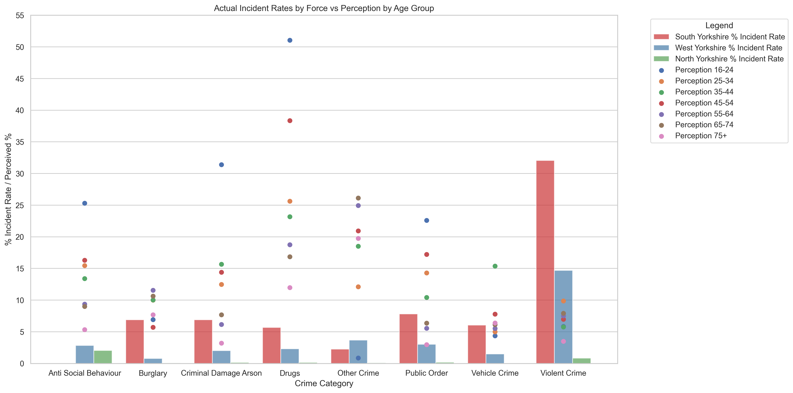
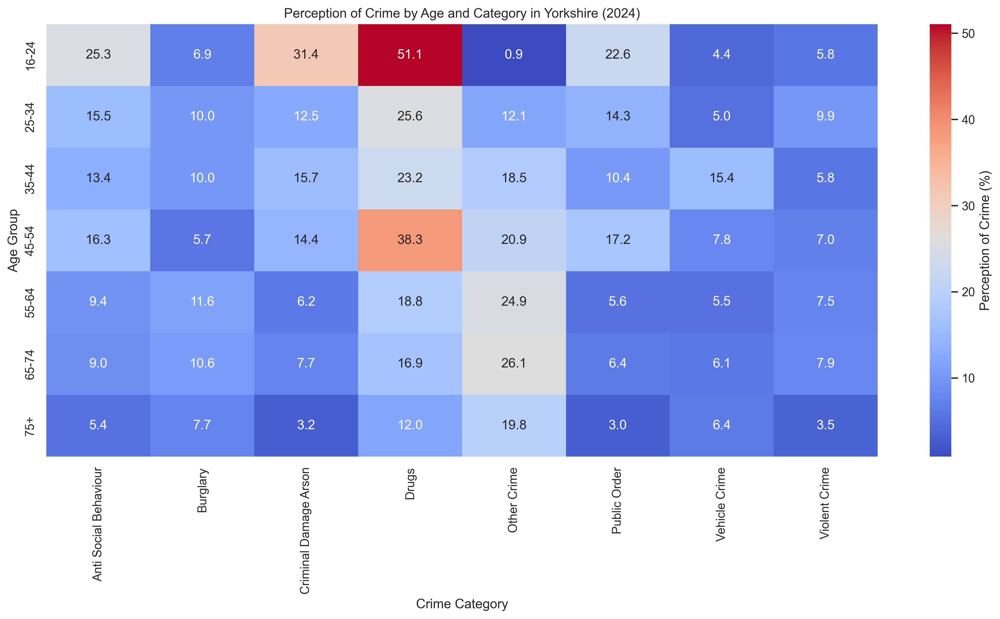
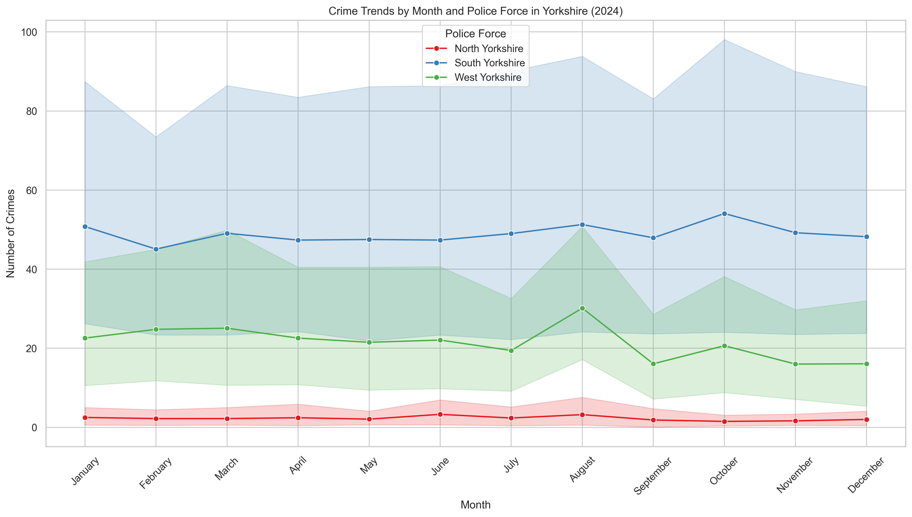

# Crime Perception vs Reality: Yorkshire (2024)

## 📌 Project Brief

A personal project driven by a long-standing interest in the gap between 
how the public perceives crime and what the data actually shows.

**The question: Do people in Yorkshire accurately perceive the level and 
type of crime in their area?**

To answer this, I combined two data sources:
- **ONS Crime Survey for England and Wales (CSEW)** — public perception 
data by age group and crime category
- **data.police.uk API** — actual recorded crime data for 2024 across 
South Yorkshire, West Yorkshire, and North Yorkshire

This end-to-end project included API data retrieval, data cleaning, 
category matching across two incompatible datasets, exploratory analysis, 
and clear visualisation of findings for a non-specialist audience.

---

## 🛠️ Technologies & Tools Used

| Category | Tools / Libraries |
|---|---|
| **Languages** | Python |
| **Data Libraries** | Pandas, NumPy |
| **Visualisation** | Matplotlib, Seaborn |
| **Data Sources** | data.police.uk API, ONS CSEW Open Data Tables |
| **Notebook Tools** | Jupyter Notebook |
| **Design** | Canva |

---

## 🔍 Key Findings

*Actual crime rates by force compared against public perception by crime category.*

- **People consistently overestimate crime** across almost all categories 
and age groups in Yorkshire
- **Violent crime is the exception** — residents significantly 
underestimate its prevalence. Violent crime accounts for 32% of recorded 
incidents in South Yorkshire and 15% in West Yorkshire, yet public 
perception puts it at only 7%
- **Age significantly influences perception** — younger age groups (16-24) 
show the highest perception of drug-related crime (51.1%), far exceeding 
recorded rates

*Heatmap showing how perception of crime varies by age group and crime category across Yorkshire.*

---

## ⚙️ Technical Challenges

**Category Matching Across Incompatible Datasets**
The ONS perception categories and the data.police.uk crime categories do 
not align by default. A significant part of this project involved building 
a mapping between the two classification systems to enable meaningful 
comparison. See `Category matching.ipynb`.

**API Data Retrieval at Scale**
Crime data was retrieved via the data.police.uk API for three forces across 
twelve months of 2024, requiring structured looping, error handling, and 
careful data storage.

**Data Cleaning**
Both datasets required cleaning before they could be joined — including 
handling missing values, normalising formats, and ensuring consistent 
category labels across sources.

---

## 📈 Visualisations

*Monthly crime trends across North, South, and West Yorkshire throughout 2024.*

A full set of visualisations is included in the repository, covering:
- Crime distribution by force and category
- Total crime counts by category (grouped bar charts)
- Crime comparison across all categories (percentage and absolute)
- Actual incident rate heatmaps by force
- Scatter plots by category and force

All charts are reproducible from `Final analysis.ipynb`.

---

## 📦 Deliverables

| File | Description |
|---|---|
| `API call.ipynb` | Retrieves crime data from data.police.uk API |
| `Category matching.ipynb` | Maps ONS and police API categories |
| `Working_Perception_Merge.ipynb` | Merges and cleans both datasets |
| `Final analysis.ipynb` | Full analysis and visualisations |
| `complete doc.ipynb` | End-to-end combined notebook |

📊 [View the presentation on Canva](https://canva.link/v7t17mpyp0vm87w)

---

## 📂 Data Sources

- [ONS Crime Survey for England and Wales (CSEW)](https://www.ons.gov.uk/peoplepopulationandcommunity/crimeandjustice/datasets/crimeinenglandandwalesannualtrendanddemographictables)
- [data.police.uk API](https://data.police.uk/docs/)

---

## ✅ Summary

This project demonstrates the full data analysis cycle — from API retrieval 
and multi-source data cleaning through to insight generation and clear visual 
communication for a non-specialist audience.

It also reflects a personal interest in the responsible use of data in 
criminal justice contexts: understanding not just what the numbers say, but 
what they mean, and where public narrative diverges from reality.
